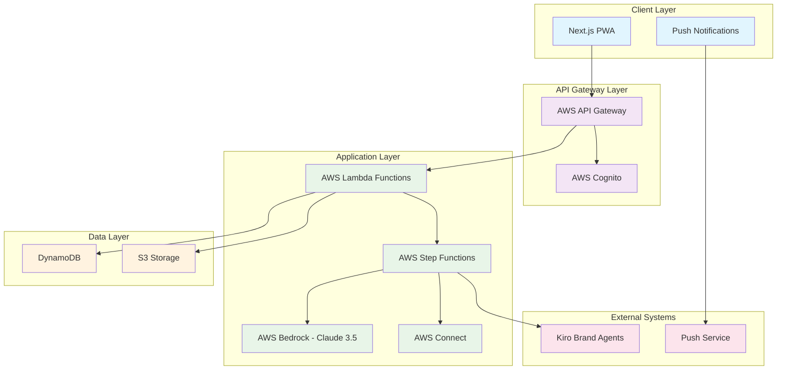
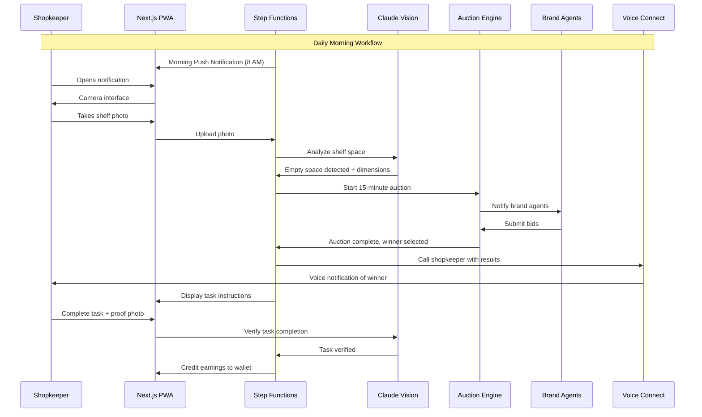

# Design Document

## Overview

Shelf-Bidder is an Autonomous Retail Ad-Network that transforms physical store shelves into digital advertising real estate through automated bidding. The system consists of a Next.js Progressive Web Application (PWA) frontend, AWS serverless backend services, and AI-powered components for computer vision and autonomous bidding.

The architecture follows a microservices pattern with event-driven workflows orchestrated by AWS Step Functions. The system prioritizes simplicity for low-tech users while maintaining robust automation for brand agents and auction management.

## Architecture

### High-Level Architecture



### System Flow



## Components and Interfaces

### Frontend Components

#### Next.js PWA Application
- **Technology**: Next.js 14 with App Router, TypeScript
- **PWA Features**: Service worker for offline capability, installable, push notifications
- **Responsive Design**: Mobile-first, optimized for low-end devices and 3G connections
- **Key Pages**:
  - Dashboard: Earnings overview and daily status
  - Camera: Photo capture with guidance overlay
  - Tasks: Step-by-step task completion interface
  - Wallet: Earnings tracking and payout management

#### Service Worker
- **Caching Strategy**: Cache-first for static assets, network-first for API calls
- **Offline Queue**: Store photos and sync when connection restored
- **Background Sync**: Handle push notifications and data synchronization

### Backend Services

#### API Gateway Layer
- **AWS API Gateway**: RESTful endpoints with request validation
- **Authentication**: AWS Cognito for shopkeeper identity management
- **Rate Limiting**: Protect against abuse while allowing normal usage patterns

#### Core Lambda Functions

**Photo Processing Function**
```typescript
interface PhotoProcessingInput {
  shopkeeperId: string;
  photoUrl: string;
  timestamp: string;
}

interface PhotoProcessingOutput {
  emptySpaces: EmptySpace[];
  currentInventory: Product[];
  analysisConfidence: number;
}
```

**Auction Management Function**
```typescript
interface AuctionInput {
  auctionId: string;
  shelfSpaces: EmptySpace[];
  duration: number; // 15 minutes
}

interface AuctionOutput {
  winnerId: string;
  winningBid: number;
  productPlacement: PlacementInstructions;
}
```

**Task Verification Function**
```typescript
interface TaskVerificationInput {
  taskId: string;
  proofPhotoUrl: string;
  originalInstructions: PlacementInstructions;
}

interface TaskVerificationOutput {
  verified: boolean;
  feedback: string;
  earnings: number;
}
```

#### Step Functions Orchestration

**Daily Workflow State Machine**
```json
{
  "Comment": "Daily shelf optimization workflow",
  "StartAt": "SendMorningNotification",
  "States": {
    "SendMorningNotification": {
      "Type": "Task",
      "Resource": "arn:aws:lambda:region:account:function:SendNotification",
      "Next": "WaitForPhoto"
    },
    "WaitForPhoto": {
      "Type": "Wait",
      "Seconds": 14400,
      "Next": "CheckPhotoReceived"
    },
    "CheckPhotoReceived": {
      "Type": "Choice",
      "Choices": [
        {
          "Variable": "$.photoReceived",
          "BooleanEquals": true,
          "Next": "AnalyzePhoto"
        }
      ],
      "Default": "SendReminder"
    },
    "AnalyzePhoto": {
      "Type": "Task",
      "Resource": "arn:aws:lambda:region:account:function:AnalyzeShelfPhoto",
      "Next": "StartAuction"
    },
    "StartAuction": {
      "Type": "Parallel",
      "Branches": [
        {
          "StartAt": "NotifyBrandAgents",
          "States": {
            "NotifyBrandAgents": {
              "Type": "Task",
              "Resource": "arn:aws:lambda:region:account:function:NotifyAgents",
              "End": true
            }
          }
        },
        {
          "StartAt": "WaitForBids",
          "States": {
            "WaitForBids": {
              "Type": "Wait",
              "Seconds": 900,
              "End": true
            }
          }
        }
      ],
      "Next": "ProcessAuctionResults"
    }
  }
}
```

### AI Components

#### Claude 3.5 Vision Analysis
- **Service**: AWS Bedrock with Claude 3.5 Sonnet
- **Input**: High-resolution shelf photos (max 20MB)
- **Processing**: 
  - Empty space detection with pixel-accurate measurements
  - Product identification and categorization
  - Optimal placement zone calculation
  - Confidence scoring for reliability

**Vision Analysis Prompt Template**:
```
Analyze this retail shelf photo and provide:
1. Empty spaces: Identify all empty shelf areas with dimensions in pixels
2. Current products: List visible products with brand names and categories
3. Placement zones: Suggest optimal areas for new product placement
4. Confidence: Rate analysis confidence (0-100%)

Return structured JSON with measurements and recommendations.
```

#### Proof Verification System
- **Service**: AWS Bedrock with Claude 3.5 Sonnet
- **Input**: Before/after photos + placement instructions
- **Processing**:
  - Compare original empty space with current state
  - Verify correct product placement per instructions
  - Check for proper positioning and visibility

### External Integrations

#### Kiro Brand Agents
- **Communication**: RESTful API endpoints for auction notifications
- **Authentication**: API keys with rate limiting
- **Bid Format**:
```typescript
interface BrandBid {
  agentId: string;
  auctionId: string;
  bidAmount: number;
  productDetails: {
    name: string;
    brand: string;
    category: string;
    dimensions: Dimensions;
  };
  placementRequirements: string[];
}
```

#### AWS Connect Voice System
- **Service**: AWS Connect with text-to-speech
- **Languages**: Support for local languages based on shopkeeper preference
- **Call Flow**: Automated script with winner details and earnings information

## Data Models

### Core Entities

#### Shopkeeper
```typescript
interface Shopkeeper {
  id: string;
  name: string;
  phoneNumber: string;
  storeAddress: string;
  preferredLanguage: string;
  timezone: string;
  walletBalance: number;
  registrationDate: string;
  lastActiveDate: string;
}
```

#### Shelf Space
```typescript
interface ShelfSpace {
  id: string;
  shopkeeperId: string;
  photoUrl: string;
  analysisDate: string;
  emptySpaces: EmptySpace[];
  currentInventory: Product[];
  analysisConfidence: number;
}

interface EmptySpace {
  id: string;
  coordinates: {
    x: number;
    y: number;
    width: number;
    height: number;
  };
  shelfLevel: number;
  visibility: 'high' | 'medium' | 'low';
  accessibility: 'easy' | 'moderate' | 'difficult';
}
```

#### Auction
```typescript
interface Auction {
  id: string;
  shelfSpaceId: string;
  startTime: string;
  endTime: string;
  status: 'active' | 'completed' | 'cancelled';
  bids: Bid[];
  winnerId?: string;
  winningBid?: number;
}

interface Bid {
  id: string;
  agentId: string;
  amount: number;
  productDetails: ProductDetails;
  timestamp: string;
  status: 'valid' | 'invalid' | 'withdrawn';
}
```

#### Task
```typescript
interface Task {
  id: string;
  auctionId: string;
  shopkeeperId: string;
  instructions: PlacementInstructions;
  status: 'assigned' | 'in_progress' | 'completed' | 'failed';
  assignedDate: string;
  completedDate?: string;
  proofPhotoUrl?: string;
  earnings: number;
  verificationResult?: VerificationResult;
}

interface PlacementInstructions {
  productName: string;
  brandName: string;
  targetLocation: EmptySpace;
  positioningRules: string[];
  visualRequirements: string[];
  timeLimit: number; // hours
}
```

#### Wallet Transaction
```typescript
interface WalletTransaction {
  id: string;
  shopkeeperId: string;
  type: 'earning' | 'payout' | 'adjustment';
  amount: number;
  description: string;
  taskId?: string;
  timestamp: string;
  status: 'pending' | 'completed' | 'failed';
}
```

### Database Schema (DynamoDB)

#### Table Design
- **Shopkeepers Table**: Partition key: `shopkeeperId`
- **ShelfSpaces Table**: Partition key: `shopkeeperId`, Sort key: `analysisDate`
- **Auctions Table**: Partition key: `auctionId`, GSI: `shelfSpaceId-startTime`
- **Tasks Table**: Partition key: `shopkeeperId`, Sort key: `assignedDate`
- **Transactions Table**: Partition key: `shopkeeperId`, Sort key: `timestamp`

#### Access Patterns
1. Get shopkeeper profile: `shopkeeperId`
2. Get recent shelf analyses: `shopkeeperId` + date range
3. Get active auctions: GSI query on status
4. Get shopkeeper tasks: `shopkeeperId` + date range
5. Get wallet transactions: `shopkeeperId` + date range

## Correctness Properties

*A property is a characteristic or behavior that should hold true across all valid executions of a system—essentially, a formal statement about what the system should do. Properties serve as the bridge between human-readable specifications and machine-verifiable correctness guarantees.*

Before defining the correctness properties, I need to analyze the acceptance criteria from the requirements document to determine which ones are testable as properties.

### Property Reflection

After analyzing all acceptance criteria, I identified several areas where properties can be consolidated to eliminate redundancy:

- **Notification Properties**: Multiple timing and delivery requirements can be combined into comprehensive notification behavior
- **UI Display Properties**: Various UI consistency requirements can be unified into interface behavior properties  
- **Performance Properties**: Multiple 30-second timing requirements can be combined into response time properties
- **Wallet Properties**: All wallet-related display and update behaviors can be consolidated
- **Data Persistence Properties**: Multiple data reliability requirements can be unified into data integrity properties
- **Agent Communication Properties**: Various agent notification requirements can be combined
- **Validation Properties**: Multiple validation behaviors can be consolidated into comprehensive validation properties

### Correctness Properties

Property 1: **Morning Notification Timing**
*For any* shopkeeper with a configured timezone, the system should send push notifications at exactly 8:00 AM local time and reminder notifications at 12:00 PM local time when no response is received
**Validates: Requirements 1.1, 1.4**

Property 2: **Photo Analysis Performance**  
*For any* valid shelf photo submitted to the system, vision analysis should complete within 30 seconds and proof verification should complete within 30 seconds
**Validates: Requirements 2.2, 5.3**

Property 3: **Empty Space Detection Consistency**
*For any* shelf photo containing empty space, the Vision_Analyzer should detect the empty areas, calculate dimensions, and identify optimal placement zones with confidence scoring
**Validates: Requirements 2.3, 2.4**

Property 4: **Auction Timing and Winner Selection**
*For any* completed shelf analysis, an auction should be initiated with a 15-minute duration, and when bids are received, the highest valid bid should be selected as the winner
**Validates: Requirements 3.1, 3.4**

Property 5: **Brand Agent Communication**
*For any* auction event (start, completion), all relevant Brand_Agents should receive notifications with complete specifications, and auction results should be communicated to all participants
**Validates: Requirements 3.2, 10.1, 10.4**

Property 6: **Bid Validation Consistency**
*For any* bid submitted by Brand_Agents, the system should validate agent credentials, bid authenticity, bid amounts, and product compatibility before accepting the bid
**Validates: Requirements 3.3, 10.2**

Property 7: **Task Assignment and Voice Notification**
*For any* auction with a winner, the system should initiate a voice call to the shopkeeper with winner details, and if the call is missed, display the same information in the app with audio playback
**Validates: Requirements 4.1, 4.2, 4.3**

Property 8: **Task Completion Workflow**
*For any* active task, the system should display visual instructions, prompt for proof photos upon completion indication, and provide feedback with retry options for incorrect placements
**Validates: Requirements 5.1, 5.2, 5.5**

Property 9: **Earnings and Wallet Consistency**
*For any* verified task completion, earnings should be credited immediately to the wallet, balance should be updated with success notification, and wallet access should display current balance, daily earnings, and weekly totals
**Validates: Requirements 5.4, 6.1, 6.2, 6.3**

Property 10: **PWA Offline Functionality**
*For any* device accessing the system, PWA features should be available, offline photo queuing should work during connectivity loss, and data should sync when connection is restored
**Validates: Requirements 7.1, 7.2, 7.3, 7.4**

Property 11: **User Interface Consistency**
*For any* interface navigation or instruction display, the system should use large buttons, clear visual hierarchy, simple language, visual icons, and provide immediate feedback for all actions
**Validates: Requirements 8.1, 8.2, 8.5**

Property 12: **Error Handling and Recovery**
*For any* system error or help request, the system should provide clear actionable error messages in local language, voice-guided tutorials when help is needed, and recover gracefully without data loss
**Validates: Requirements 8.3, 8.4, 9.3**

Property 13: **Data Persistence and Integrity**
*For any* data creation, modification, or device switching, the system should persist data to DynamoDB immediately, maintain local data integrity during offline periods, and provide access to all historical data across devices
**Validates: Requirements 9.1, 9.2, 9.4**

Property 14: **Concurrent Auction Processing**
*For any* simultaneous bid submissions from multiple Brand_Agents, the auction engine should handle concurrent requests without conflicts and maintain data consistency
**Validates: Requirements 10.3**

Property 15: **Threshold-Based Notifications**
*For any* wallet balance reaching withdrawal threshold or auction with no bids, the system should send appropriate notifications with suggested actions
**Validates: Requirements 6.4, 3.5, 2.5**

## Error Handling

### Error Categories and Responses

#### Network Connectivity Errors
- **Offline Photo Capture**: Queue photos locally with visual indicators
- **API Timeouts**: Retry with exponential backoff, fallback to cached data
- **Sync Failures**: Maintain local state, retry on connection restoration

#### AI Processing Errors
- **Vision Analysis Failures**: Provide clear feedback, suggest retaking photo
- **Low Confidence Results**: Request additional photos or manual verification
- **Service Unavailable**: Queue requests, notify user of delays

#### Auction System Errors
- **No Bids Received**: Suggest optimal timing, provide market insights
- **Bid Validation Failures**: Log errors, notify agents with specific feedback
- **Concurrent Access Issues**: Implement optimistic locking, retry mechanisms

#### User Interface Errors
- **Camera Access Denied**: Provide clear instructions for permission granting
- **Photo Upload Failures**: Show progress indicators, retry options
- **Voice Call Failures**: Fallback to in-app notifications with audio

### Error Recovery Strategies

#### Graceful Degradation
- **Offline Mode**: Core functionality available without network
- **Reduced Features**: Essential operations continue during partial failures
- **Progressive Enhancement**: Advanced features activate when services available

#### Data Consistency
- **Transaction Rollback**: Ensure atomic operations for critical data
- **Conflict Resolution**: Last-write-wins with user notification
- **Backup Recovery**: Automatic restoration from redundant copies

## Testing Strategy

### Dual Testing Approach

The testing strategy employs both unit testing and property-based testing to ensure comprehensive coverage:

**Unit Tests**: Focus on specific examples, edge cases, and error conditions
- Integration points between PWA and backend services
- Camera interface functionality and photo upload
- Voice notification system integration
- Wallet transaction processing
- Error scenarios and recovery mechanisms

**Property Tests**: Verify universal properties across all inputs using property-based testing
- Each correctness property implemented as a property-based test
- Minimum 100 iterations per property test for thorough validation
- Comprehensive input coverage through randomization

### Property-Based Testing Configuration

**Technology Stack**:
- **Frontend**: Jest with fast-check for TypeScript property testing
- **Backend**: Jest with fast-check for Lambda function testing
- **Integration**: Testcontainers for DynamoDB and AWS service mocking

**Test Configuration**:
- Minimum 100 iterations per property test
- Each test tagged with feature name and property reference
- Tag format: **Feature: shelf-bidder, Property {number}: {property_text}**

**Property Test Implementation**:
Each correctness property must be implemented as a single property-based test that references the design document property. Tests should generate random valid inputs and verify the universal property holds across all generated cases.

### Testing Environments

#### Local Development
- **Mock Services**: LocalStack for AWS services simulation
- **Test Data**: Synthetic shopkeeper profiles and shelf images
- **Performance**: Response time validation under simulated load

#### Staging Environment
- **Real AWS Services**: Full integration testing with actual services
- **Load Testing**: Concurrent user simulation and auction stress testing
- **End-to-End**: Complete workflow validation from notification to earnings

#### Production Monitoring
- **Health Checks**: Continuous monitoring of all service endpoints
- **Performance Metrics**: Response time tracking and SLA validation
- **Error Tracking**: Comprehensive logging and alerting for failures