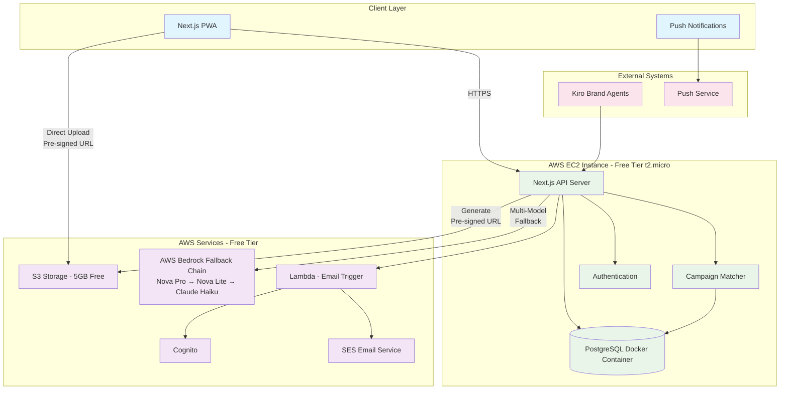
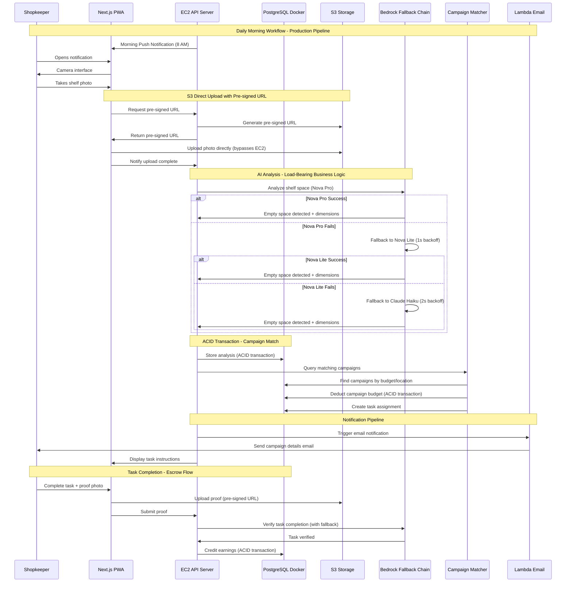

# Design Document

## Overview

Shelf-Bidder is an Autonomous Retail Ad-Network that transforms physical store shelves into digital advertising real estate through automated campaign matching. The system consists of a Next.js Progressive Web Application (PWA) frontend, an AWS EC2-hosted API server, PostgreSQL database running as a Docker container on EC2, and AWS services for vision analysis, storage, and email notifications.

The architecture follows an AWS-centric approach optimized for Free Tier cost efficiency. The EC2 instance hosts both the Next.js API server and PostgreSQL Docker container, while AWS services provide specialized capabilities. The system prioritizes ACID-compliant transactions for financial operations while maintaining simplicity for low-tech users through automated campaign matching. AI-powered empty space detection is load-bearing—essential for the core business logic—with a resilient multi-model fallback chain (Nova Pro → Nova Lite → Claude Haiku) ensuring continuous operation even when primary models fail.

## Architecture

### High-Level Architecture



### System Flow



### AWS Free Tier Cost Optimization

The system is architected to maximize AWS Free Tier benefits while maintaining production-ready infrastructure:

#### EC2 Free Tier (12 months)
- **Instance Type**: t2.micro or t3.micro (1 vCPU, 1GB RAM)
- **Free Hours**: 750 hours per month (sufficient for 24/7 operation)
- **Hosting**: Next.js API server + PostgreSQL Docker container
- **Cost**: $0 for first 12 months

#### S3 Free Tier (12 months)
- **Storage**: 5GB standard storage
- **Requests**: 20,000 GET requests, 2,000 PUT requests per month
- **Data Transfer**: 15GB out per month
- **Optimization**: Direct client-to-S3 upload minimizes EC2 bandwidth
- **Lifecycle**: Automatic Glacier transition for photos >30 days old
- **Cost**: $0 for first 12 months within limits

#### Bedrock Pricing (Pay-per-use)
- **Nova Pro**: $0.80 per 1M input tokens, $3.20 per 1M output tokens
- **Nova Lite**: $0.06 per 1M input tokens, $0.24 per 1M output tokens
- **Claude Haiku**: $0.25 per 1M input tokens, $1.25 per 1M output tokens
- **Optimization**: Fallback chain uses cheaper models when primary fails
- **Estimated Cost**: ~$5-10/month for hackathon demo (100-200 analyses)

#### Lambda Free Tier (Always Free)
- **Requests**: 1M free requests per month
- **Compute**: 400,000 GB-seconds per month
- **Use Case**: Email notifications (low frequency)
- **Cost**: $0 within free tier

#### Total Infrastructure Cost
- **First 12 Months**: ~$5-10/month (Bedrock only)
- **After 12 Months**: ~$15-25/month (EC2 + S3 + Bedrock)
- **Hackathon Phase**: Fully within AWS Free Tier except Bedrock usage

#### Cost Optimization Strategies
1. **Single EC2 Instance**: Host both API and PostgreSQL Docker container
2. **Direct S3 Upload**: Pre-signed URLs bypass EC2 bandwidth charges
3. **Bedrock Fallback**: Use cheaper models (Nova Lite, Haiku) when possible
4. **S3 Lifecycle**: Automatic Glacier transition reduces storage costs
5. **Lambda Email**: Serverless email delivery with no idle costs
6. **Connection Pooling**: Minimize database connection overhead

## Components and Interfaces

### Frontend Components

#### Next.js PWA Application
- **Technology**: Next.js 14 with App Router, TypeScript
- **PWA Features**: Service worker for offline capability, installable, push notifications
- **Responsive Design**: Mobile-first, optimized for low-end devices and 3G connections
- **Key Pages**:
  - Dashboard: Earnings overview and daily status
  - Camera: Photo capture with guidance overlay
  - Tasks: Step-by-step task completion interface
  - Wallet: Earnings tracking and payout management

#### Service Worker
- **Caching Strategy**: Cache-first for static assets, network-first for API calls
- **Offline Queue**: Store photos and sync when connection restored
- **Background Sync**: Handle push notifications and data synchronization

### EC2 Backend Services

#### Next.js API Server on EC2
- **Technology**: Next.js 14 API Routes with TypeScript on AWS EC2 Free Tier (t2.micro)
- **Database**: PostgreSQL 15 running as Docker container on same EC2 instance
- **Authentication**: JWT-based authentication with refresh tokens
- **Rate Limiting**: Protect against abuse while allowing normal usage patterns
- **Cost Optimization**: Single EC2 instance hosts both API and database for $0 within Free Tier (750 hrs/month)

#### Core API Endpoints

**Photo Processing Endpoint**
```typescript
interface PhotoProcessingRequest {
  shopkeeperId: string;
  photoMetadata: {
    timestamp: string;
    location?: string;
  };
}

interface PhotoProcessingResponse {
  preSignedUrl: string;
  uploadId: string;
  expiresIn: number; // 300 seconds (5 minutes)
  s3Key: string;
}

// EC2 generates pre-signed URL for direct client-to-S3 upload
// This minimizes EC2 bandwidth usage and stays within Free Tier limits
```

**Campaign Matching Endpoint**
```typescript
interface CampaignMatchRequest {
  shelfSpaceId: string;
  emptySpaces: EmptySpace[];
  location: string;
}

interface CampaignMatchResponse {
  matchedCampaign?: {
    campaignId: string;
    brandName: string;
    productName: string;
    earnings: number;
    instructions: PlacementInstructions;
  };
  taskId?: string;
}
```

**Task Verification Endpoint**
```typescript
interface TaskVerificationRequest {
  taskId: string;
  proofPhotoUrl: string;
}

interface TaskVerificationResponse {
  verified: boolean;
  feedback: string;
  earnings?: number;
  transactionId?: string;
}
```

#### Campaign Matching Engine

**Campaign Matcher Service**
```typescript
class CampaignMatcher {
  async findMatchingCampaigns(
    emptySpaces: EmptySpace[],
    location: string
  ): Promise<Campaign[]> {
    // Query PostgreSQL Docker container for active campaigns
    // Filter by budget availability and location proximity
    // Sort by priority (budget, distance, campaign age)
  }

  async matchAndDeductBudget(
    campaignId: string,
    amount: number
  ): Promise<boolean> {
    // Use PostgreSQL ACID transaction to:
    // 1. Check campaign budget
    // 2. Deduct amount if sufficient
    // 3. Create task assignment
    // 4. Commit or rollback atomically
    // All operations within Docker container on EC2
  }
}
```

### AWS Services Integration

#### AWS Bedrock Multi-Model Fallback Chain (Load-Bearing AI)

The Vision Analyzer is essential for business logic—empty space detection cannot function without AI. The system implements a resilient multi-model fallback chain to ensure continuous operation.

- **Service**: AWS Bedrock with automatic model fallback
- **Primary Model**: amazon.nova-pro-v1:0 (highest accuracy)
- **Secondary Model**: amazon.nova-lite-v1:0 (faster, cost-effective)
- **Tertiary Model**: anthropic.claude-3-haiku-20240307-v1:0 (final fallback)
- **Input**: High-resolution shelf photos from S3 (max 20MB)
- **Processing**: 
  - Empty space detection with pixel-accurate measurements
  - Product identification and categorization
  - Optimal placement zone calculation
  - Confidence scoring for reliability

**Fallback Logic**:
```typescript
class BedrockFallbackChain {
  private models = [
    'amazon.nova-pro-v1:0',      // Primary: Best accuracy
    'amazon.nova-lite-v1:0',     // Secondary: Fast & cost-effective
    'anthropic.claude-3-haiku-20240307-v1:0'  // Tertiary: Final fallback
  ];
  
  private backoffDelays = [1000, 2000, 4000]; // Exponential backoff in ms
  
  async analyzeWithFallback(s3Url: string): Promise<ShelfAnalysis> {
    let lastError: Error | null = null;
    
    for (let i = 0; i < this.models.length; i++) {
      try {
        const model = this.models[i];
        console.log(`Attempting analysis with ${model}`);
        
        const result = await this.callBedrock(model, s3Url);
        
        // Log successful model usage
        await this.logModelUsage(model, 'success');
        
        return result;
      } catch (error) {
        lastError = error;
        await this.logModelUsage(this.models[i], 'failure', error);
        
        // If not the last model, wait before trying next
        if (i < this.models.length - 1) {
          await this.sleep(this.backoffDelays[i]);
        }
      }
    }
    
    // All models failed - alert operators after 10 consecutive failures
    await this.checkConsecutiveFailures();
    throw new Error(`All Bedrock models failed: ${lastError?.message}`);
  }
  
  private async callBedrock(modelId: string, s3Url: string): Promise<ShelfAnalysis> {
    const prompt = `
    Analyze this retail shelf photo and provide:
    1. Empty spaces: Identify all empty shelf areas with dimensions
    2. Current products: List visible products with categories
    3. Placement zones: Suggest optimal areas for new products
    4. Confidence: Rate analysis confidence (0-100%)
    
    Return structured JSON with measurements and recommendations.
    `;
    
    // Call Bedrock with specified model
    const response = await this.bedrockClient.invokeModel({
      modelId,
      body: JSON.stringify({
        prompt,
        image: s3Url,
        max_tokens: 2000
      })
    });
    
    return this.parseResponse(response);
  }
  
  private async logModelUsage(
    model: string, 
    status: 'success' | 'failure', 
    error?: Error
  ): Promise<void> {
    // Log to PostgreSQL for monitoring and alerting
    await db.query(`
      INSERT INTO bedrock_usage_logs (model, status, error_message, timestamp)
      VALUES ($1, $2, $3, NOW())
    `, [model, status, error?.message]);
  }
  
  private async checkConsecutiveFailures(): Promise<void> {
    const recentFailures = await db.query(`
      SELECT COUNT(*) as failure_count
      FROM bedrock_usage_logs
      WHERE status = 'failure'
      AND timestamp > NOW() - INTERVAL '1 hour'
      ORDER BY timestamp DESC
      LIMIT 10
    `);
    
    if (recentFailures.rows[0].failure_count >= 10) {
      // Alert system operators
      await this.alertOperators('Bedrock: 10 consecutive failures detected');
    }
  }
  
  private sleep(ms: number): Promise<void> {
    return new Promise(resolve => setTimeout(resolve, ms));
  }
}
```

**Vision Analysis Implementation**:
```typescript
class BedrockVisionService {
  private fallbackChain: BedrockFallbackChain;
  
  constructor() {
    this.fallbackChain = new BedrockFallbackChain();
  }
  
  async analyzeShelfPhoto(s3Url: string): Promise<ShelfAnalysis> {
    // Use fallback chain for resilient analysis
    return await this.fallbackChain.analyzeWithFallback(s3Url);
  }
  
  async verifyTaskCompletion(
    beforeUrl: string, 
    afterUrl: string
  ): Promise<VerificationResult> {
    // Use fallback chain for proof verification
    return await this.fallbackChain.analyzeWithFallback(afterUrl);
  }
}
```

**Error Handling and Resilience**:
- Exponential backoff between model attempts (1s, 2s, 4s)
- Comprehensive logging of model usage and failures
- Automatic operator alerts after 10 consecutive failures
- Graceful degradation with clear user feedback
- System maintains operation even when primary model unavailable

#### AWS Lambda Email Notifications
- **Service**: AWS Lambda triggered by EC2 API calls
- **Authentication**: AWS Cognito for email management
- **Email Service**: Amazon SES for reliable delivery
- **Templates**: Pre-configured email templates for different notification types

**Lambda Email Function**:
```typescript
export const handler = async (event: {
  shopkeeperEmail: string;
  campaignDetails: CampaignDetails;
  taskInstructions: PlacementInstructions;
}) => {
  // Use Cognito to validate email
  // Format email content with campaign details
  // Send via SES with retry logic
  // Return delivery status
};
```

#### PostgreSQL Docker Container on EC2
- **Service**: PostgreSQL 15 running as Docker container on EC2 instance
- **Cost**: $0 additional cost (uses EC2 Free Tier compute)
- **Persistence**: Docker volumes mounted to EC2 EBS storage
- **Connection**: Local socket connection from Next.js API (minimal latency)
- **Backup**: Automated snapshots using EBS volume snapshots

**Docker Container Setup**:
```typescript
// docker-compose.yml on EC2
services:
  postgres:
    image: postgres:15-alpine
    container_name: shelf-bidder-db
    environment:
      POSTGRES_DB: shelf_bidder
      POSTGRES_USER: ${DB_USER}
      POSTGRES_PASSWORD: ${DB_PASSWORD}
    volumes:
      - postgres_data:/var/lib/postgresql/data
      - ./init.sql:/docker-entrypoint-initdb.d/init.sql
    ports:
      - "5432:5432"
    restart: unless-stopped
    healthcheck:
      test: ["CMD-SHELL", "pg_isready -U ${DB_USER}"]
      interval: 10s
      timeout: 5s
      retries: 5

volumes:
  postgres_data:
    driver: local
```

**Connection Pooling**:
```typescript
import { Pool } from 'pg';

const pool = new Pool({
  host: 'localhost', // Docker container on same EC2 instance
  port: 5432,
  database: process.env.DB_NAME,
  user: process.env.DB_USER,
  password: process.env.DB_PASSWORD,
  max: 20, // Maximum pool size
  idleTimeoutMillis: 30000,
  connectionTimeoutMillis: 2000,
});

export default pool;
```

#### S3 Direct Upload with Pre-Signed URLs
- **Service**: Amazon S3 with pre-signed URLs (5GB Free Tier)
- **Security**: Time-limited URLs (5 minutes) with specific permissions (PutObject only)
- **Organization**: Structured folder hierarchy by shopkeeper and date
- **Lifecycle**: Automatic archival to S3 Glacier when approaching 5GB limit
- **Cost Optimization**: Direct client-to-S3 upload bypasses EC2, minimizing bandwidth costs

**S3 Direct Upload Flow**:
```typescript
class S3UploadService {
  async generatePreSignedUrl(
    shopkeeperId: string,
    photoType: 'shelf' | 'proof'
  ): Promise<PreSignedUrlResponse> {
    const key = `${shopkeeperId}/${new Date().toISOString()}/${photoType}.jpg`;
    
    const command = new PutObjectCommand({
      Bucket: process.env.S3_BUCKET_NAME,
      Key: key,
      ContentType: 'image/jpeg',
      Metadata: {
        shopkeeperId,
        photoType,
        uploadedAt: new Date().toISOString()
      }
    });
    
    // Generate pre-signed URL valid for 5 minutes
    const preSignedUrl = await getSignedUrl(this.s3Client, command, {
      expiresIn: 300
    });
    
    return {
      preSignedUrl,
      s3Key: key,
      expiresIn: 300
    };
  }
  
  async checkStorageUsage(): Promise<void> {
    // Monitor S3 usage and apply lifecycle policies
    const usage = await this.getStorageMetrics();
    
    if (usage.totalGB > 4.5) { // 90% of 5GB free tier
      console.warn('Approaching S3 Free Tier limit, applying lifecycle policies');
      await this.applyGlacierTransition();
    }
  }
  
  private async applyGlacierTransition(): Promise<void> {
    // Transition photos older than 30 days to Glacier
    await this.s3Client.putBucketLifecycleConfiguration({
      Bucket: process.env.S3_BUCKET_NAME,
      LifecycleConfiguration: {
        Rules: [{
          Id: 'ArchiveOldPhotos',
          Status: 'Enabled',
          Transitions: [{
            Days: 30,
            StorageClass: 'GLACIER'
          }]
        }]
      }
    });
  }
}
```

### External Integrations

#### Kiro Brand Agents
- **Communication**: RESTful API endpoints for campaign management
- **Authentication**: API keys with rate limiting
- **Campaign Format**:
```typescript
interface BrandCampaign {
  agentId: string;
  campaignId: string;
  budget: number;
  productDetails: {
    name: string;
    brand: string;
    category: string;
    dimensions: Dimensions;
  };
  targetLocations: string[];
  placementRequirements: string[];
  duration: {
    startDate: string;
    endDate: string;
  };
}
```

## Data Models

### PostgreSQL Database Schema (Docker Container on EC2)

The database runs as a Docker container on the EC2 instance, providing ACID-compliant transactions for all financial operations at $0 additional cost within AWS Free Tier.

#### Core Tables

**Shopkeepers Table**
```sql
CREATE TABLE shopkeepers (
  id UUID PRIMARY KEY DEFAULT gen_random_uuid(),
  name VARCHAR(255) NOT NULL,
  phone_number VARCHAR(20) UNIQUE NOT NULL,
  store_address TEXT NOT NULL,
  preferred_language VARCHAR(10) DEFAULT 'en',
  timezone VARCHAR(50) DEFAULT 'UTC',
  wallet_balance DECIMAL(10,2) DEFAULT 0.00,
  registration_date TIMESTAMP DEFAULT CURRENT_TIMESTAMP,
  last_active_date TIMESTAMP DEFAULT CURRENT_TIMESTAMP,
  created_at TIMESTAMP DEFAULT CURRENT_TIMESTAMP,
  updated_at TIMESTAMP DEFAULT CURRENT_TIMESTAMP
);

CREATE INDEX idx_shopkeepers_phone ON shopkeepers(phone_number);
CREATE INDEX idx_shopkeepers_last_active ON shopkeepers(last_active_date);
```

**Shelf Spaces Table**
```sql
CREATE TABLE shelf_spaces (
  id UUID PRIMARY KEY DEFAULT gen_random_uuid(),
  shopkeeper_id UUID NOT NULL REFERENCES shopkeepers(id),
  photo_url TEXT NOT NULL,
  analysis_date TIMESTAMP DEFAULT CURRENT_TIMESTAMP,
  empty_spaces JSONB NOT NULL,
  current_inventory JSONB NOT NULL,
  analysis_confidence INTEGER CHECK (analysis_confidence >= 0 AND analysis_confidence <= 100),
  created_at TIMESTAMP DEFAULT CURRENT_TIMESTAMP,
  updated_at TIMESTAMP DEFAULT CURRENT_TIMESTAMP
);

CREATE INDEX idx_shelf_spaces_shopkeeper ON shelf_spaces(shopkeeper_id);
CREATE INDEX idx_shelf_spaces_date ON shelf_spaces(analysis_date);
CREATE INDEX idx_shelf_spaces_confidence ON shelf_spaces(analysis_confidence);
```

**Campaigns Table**
```sql
CREATE TABLE campaigns (
  id UUID PRIMARY KEY DEFAULT gen_random_uuid(),
  agent_id VARCHAR(255) NOT NULL,
  brand_name VARCHAR(255) NOT NULL,
  product_name VARCHAR(255) NOT NULL,
  product_category VARCHAR(100) NOT NULL,
  budget DECIMAL(10,2) NOT NULL CHECK (budget > 0),
  remaining_budget DECIMAL(10,2) NOT NULL CHECK (remaining_budget >= 0),
  target_locations TEXT[] NOT NULL,
  placement_requirements JSONB NOT NULL,
  product_dimensions JSONB NOT NULL,
  start_date TIMESTAMP NOT NULL,
  end_date TIMESTAMP NOT NULL,
  status VARCHAR(20) DEFAULT 'active' CHECK (status IN ('active', 'paused', 'completed', 'cancelled')),
  created_at TIMESTAMP DEFAULT CURRENT_TIMESTAMP,
  updated_at TIMESTAMP DEFAULT CURRENT_TIMESTAMP
);

CREATE INDEX idx_campaigns_agent ON campaigns(agent_id);
CREATE INDEX idx_campaigns_status ON campaigns(status);
CREATE INDEX idx_campaigns_budget ON campaigns(remaining_budget) WHERE status = 'active';
CREATE INDEX idx_campaigns_location ON campaigns USING GIN(target_locations);
CREATE INDEX idx_campaigns_dates ON campaigns(start_date, end_date);
```

**Tasks Table**
```sql
CREATE TABLE tasks (
  id UUID PRIMARY KEY DEFAULT gen_random_uuid(),
  campaign_id UUID NOT NULL REFERENCES campaigns(id),
  shopkeeper_id UUID NOT NULL REFERENCES shopkeepers(id),
  shelf_space_id UUID NOT NULL REFERENCES shelf_spaces(id),
  instructions JSONB NOT NULL,
  status VARCHAR(20) DEFAULT 'assigned' CHECK (status IN ('assigned', 'in_progress', 'completed', 'failed')),
  assigned_date TIMESTAMP DEFAULT CURRENT_TIMESTAMP,
  completed_date TIMESTAMP,
  proof_photo_url TEXT,
  earnings DECIMAL(10,2) NOT NULL CHECK (earnings >= 0),
  verification_result JSONB,
  created_at TIMESTAMP DEFAULT CURRENT_TIMESTAMP,
  updated_at TIMESTAMP DEFAULT CURRENT_TIMESTAMP
);

CREATE INDEX idx_tasks_shopkeeper ON tasks(shopkeeper_id);
CREATE INDEX idx_tasks_campaign ON tasks(campaign_id);
CREATE INDEX idx_tasks_status ON tasks(status);
CREATE INDEX idx_tasks_assigned_date ON tasks(assigned_date);
```

**Wallet Transactions Table**
```sql
CREATE TABLE wallet_transactions (
  id UUID PRIMARY KEY DEFAULT gen_random_uuid(),
  shopkeeper_id UUID NOT NULL REFERENCES shopkeepers(id),
  task_id UUID REFERENCES tasks(id),
  type VARCHAR(20) NOT NULL CHECK (type IN ('earning', 'payout', 'adjustment')),
  amount DECIMAL(10,2) NOT NULL,
  description TEXT NOT NULL,
  status VARCHAR(20) DEFAULT 'completed' CHECK (status IN ('pending', 'completed', 'failed')),
  transaction_date TIMESTAMP DEFAULT CURRENT_TIMESTAMP,
  created_at TIMESTAMP DEFAULT CURRENT_TIMESTAMP,
  updated_at TIMESTAMP DEFAULT CURRENT_TIMESTAMP
);

CREATE INDEX idx_wallet_transactions_shopkeeper ON wallet_transactions(shopkeeper_id);
CREATE INDEX idx_wallet_transactions_date ON wallet_transactions(transaction_date);
CREATE INDEX idx_wallet_transactions_type ON wallet_transactions(type);
CREATE INDEX idx_wallet_transactions_status ON wallet_transactions(status);
```

**Bedrock Usage Logs Table**
```sql
CREATE TABLE bedrock_usage_logs (
  id UUID PRIMARY KEY DEFAULT gen_random_uuid(),
  model VARCHAR(100) NOT NULL,
  status VARCHAR(20) NOT NULL CHECK (status IN ('success', 'failure')),
  error_message TEXT,
  request_type VARCHAR(50) NOT NULL CHECK (request_type IN ('analysis', 'verification')),
  shopkeeper_id UUID REFERENCES shopkeepers(id),
  response_time_ms INTEGER,
  timestamp TIMESTAMP DEFAULT CURRENT_TIMESTAMP,
  created_at TIMESTAMP DEFAULT CURRENT_TIMESTAMP
);

CREATE INDEX idx_bedrock_logs_model ON bedrock_usage_logs(model);
CREATE INDEX idx_bedrock_logs_status ON bedrock_usage_logs(status);
CREATE INDEX idx_bedrock_logs_timestamp ON bedrock_usage_logs(timestamp);
CREATE INDEX idx_bedrock_logs_shopkeeper ON bedrock_usage_logs(shopkeeper_id);

-- Index for consecutive failure detection
CREATE INDEX idx_bedrock_recent_failures ON bedrock_usage_logs(timestamp DESC, status) 
WHERE status = 'failure' AND timestamp > NOW() - INTERVAL '1 hour';
```

#### ACID Transaction Examples

**Campaign Budget Deduction with Task Creation**
```sql
BEGIN;

-- Check and deduct campaign budget
UPDATE campaigns 
SET remaining_budget = remaining_budget - :earnings,
    updated_at = CURRENT_TIMESTAMP
WHERE id = :campaign_id 
  AND remaining_budget >= :earnings 
  AND status = 'active';

-- Verify the update succeeded
SELECT remaining_budget FROM campaigns WHERE id = :campaign_id;

-- Create task assignment
INSERT INTO tasks (campaign_id, shopkeeper_id, shelf_space_id, instructions, earnings)
VALUES (:campaign_id, :shopkeeper_id, :shelf_space_id, :instructions, :earnings);

COMMIT;
```

**Shopkeeper Earnings Credit**
```sql
BEGIN;

-- Update task status
UPDATE tasks 
SET status = 'completed',
    completed_date = CURRENT_TIMESTAMP,
    proof_photo_url = :proof_url,
    verification_result = :verification_result,
    updated_at = CURRENT_TIMESTAMP
WHERE id = :task_id;

-- Credit shopkeeper wallet
UPDATE shopkeepers 
SET wallet_balance = wallet_balance + :earnings,
    updated_at = CURRENT_TIMESTAMP
WHERE id = :shopkeeper_id;

-- Record transaction
INSERT INTO wallet_transactions (shopkeeper_id, task_id, type, amount, description)
VALUES (:shopkeeper_id, :task_id, 'earning', :earnings, :description);

COMMIT;
```

### TypeScript Data Models

#### Core Entities

```typescript
interface Shopkeeper {
  id: string;
  name: string;
  phoneNumber: string;
  storeAddress: string;
  preferredLanguage: string;
  timezone: string;
  walletBalance: number;
  registrationDate: string;
  lastActiveDate: string;
}

interface ShelfSpace {
  id: string;
  shopkeeperId: string;
  photoUrl: string;
  analysisDate: string;
  emptySpaces: EmptySpace[];
  currentInventory: Product[];
  analysisConfidence: number;
}

interface EmptySpace {
  id: string;
  coordinates: {
    x: number;
    y: number;
    width: number;
    height: number;
  };
  shelfLevel: number;
  visibility: 'high' | 'medium' | 'low';
  accessibility: 'easy' | 'moderate' | 'difficult';
}

interface Campaign {
  id: string;
  agentId: string;
  brandName: string;
  productName: string;
  productCategory: string;
  budget: number;
  remainingBudget: number;
  targetLocations: string[];
  placementRequirements: PlacementRequirement[];
  productDimensions: Dimensions;
  startDate: string;
  endDate: string;
  status: 'active' | 'paused' | 'completed' | 'cancelled';
}

interface Task {
  id: string;
  campaignId: string;
  shopkeeperId: string;
  shelfSpaceId: string;
  instructions: PlacementInstructions;
  status: 'assigned' | 'in_progress' | 'completed' | 'failed';
  assignedDate: string;
  completedDate?: string;
  proofPhotoUrl?: string;
  earnings: number;
  verificationResult?: VerificationResult;
}

interface WalletTransaction {
  id: string;
  shopkeeperId: string;
  taskId?: string;
  type: 'earning' | 'payout' | 'adjustment';
  amount: number;
  description: string;
  status: 'pending' | 'completed' | 'failed';
  transactionDate: string;
}

interface BedrockUsageLog {
  id: string;
  model: string;
  status: 'success' | 'failure';
  errorMessage?: string;
  requestType: 'analysis' | 'verification';
  shopkeeperId?: string;
  responseTimeMs?: number;
  timestamp: string;
}
```

## Correctness Properties

*A property is a characteristic or behavior that should hold true across all valid executions of a system—essentially, a formal statement about what the system should do. Properties serve as the bridge between human-readable specifications and machine-verifiable correctness guarantees.*

### Property Reflection

After analyzing all acceptance criteria, I identified several areas where properties can be consolidated to eliminate redundancy:

- **Notification Properties**: Multiple timing and delivery requirements can be combined into comprehensive notification behavior
- **UI Display Properties**: Various UI consistency requirements can be unified into interface behavior properties  
- **Performance Properties**: Multiple 30-second timing requirements can be combined into response time properties
- **Wallet Properties**: All wallet-related display and update behaviors can be consolidated
- **Data Persistence Properties**: Multiple data reliability requirements can be unified into data integrity properties
- **Campaign Management Properties**: Various campaign matching and budget requirements can be combined
- **ACID Transaction Properties**: Multiple transaction consistency requirements can be consolidated

### Correctness Properties

Property 1: **Morning Notification Timing**
*For any* shopkeeper with a configured timezone, the system should send push notifications at exactly 8:00 AM local time and reminder notifications at 12:00 PM local time when no response is received
**Validates: Requirements 1.1, 1.4**

Property 2: **Photo Analysis Performance**  
*For any* valid shelf photo submitted to the system, vision analysis should complete within 30 seconds and proof verification should complete within 30 seconds
**Validates: Requirements 2.3, 5.3**

Property 3: **S3 Direct Upload Workflow**
*For any* photo capture request, the EC2 server should generate a valid pre-signed S3 URL with 5-minute expiration, and the frontend should upload directly to S3 before triggering analysis
**Validates: Requirements 2.2, 2.3**

Property 4: **Campaign Matching and Budget Deduction**
*For any* completed shelf analysis, the Campaign_Matcher should query active campaigns from PostgreSQL Docker container, match based on budget and location, and deduct budget using ACID transactions
**Validates: Requirements 3.1, 3.2, 3.3, 3.6**

Property 5: **Email Notification Delivery**
*For any* successful campaign match, the EC2 server should trigger AWS Lambda for email notification, and the Email_Notifier should use Cognito and SES to deliver campaign details
**Validates: Requirements 4.1, 4.2, 4.6**

Property 6: **Task Assignment Workflow**
*For any* campaign match, the system should create a task assignment in PostgreSQL, display information in the app, and provide step-by-step visual guidance
**Validates: Requirements 4.3, 4.4, 4.5**

Property 7: **Bedrock Multi-Model Fallback Chain**
*For any* photo analysis or verification request, the Vision_Analyzer should attempt Nova Pro first, then fallback to Nova Lite (1s backoff), then Claude Haiku (2s backoff), and complete within specified time limits
**Validates: Requirements 2.4, 5.3, 13.1, 13.2, 13.3, 13.7**

Property 8: **ACID Transaction Consistency for Earnings**
*For any* verified task completion, the system should credit earnings using PostgreSQL ACID transactions in Docker container, ensuring atomic updates to task status, shopkeeper balance, and transaction records
**Validates: Requirements 5.4, 5.6, 6.1, 6.6**

Property 9: **PostgreSQL Data Integrity**
*For any* financial operation, the PostgreSQL Docker container should use ACID transactions, row-level locking for concurrent operations, and rollback incomplete transactions on failure
**Validates: Requirements 9.1, 9.3, 9.5, 9.6**

Property 10: **EC2 API Server Reliability**
*For any* PWA API call, the EC2 server should handle business logic, database operations with Docker PostgreSQL, and maintain transaction integrity during network issues
**Validates: Requirements 7.2, 7.6, 9.2**

Property 11: **Campaign Budget Management**
*For any* campaign operation, the system should validate agent credentials, ensure atomic budget updates in PostgreSQL, and automatically deactivate campaigns when budgets are depleted
**Validates: Requirements 10.1, 10.2, 10.4, 10.6**

Property 12: **User Interface Consistency**
*For any* interface navigation or instruction display, the system should use large buttons, clear visual hierarchy, simple language, visual icons, and provide immediate feedback for all actions
**Validates: Requirements 8.1, 8.2, 8.5**

Property 13: **Error Handling and Recovery**
*For any* system error or help request, the system should provide clear actionable error messages in local language, voice-guided tutorials when help is needed, and recover gracefully without data loss
**Validates: Requirements 8.3, 8.4, 9.3**

Property 14: **PWA Offline Functionality**
*For any* device accessing the system, PWA features should be available, offline photo queuing should work during connectivity loss, and data should sync when connection is restored
**Validates: Requirements 7.1, 7.3, 7.4, 7.5**

Property 15: **Wallet Balance and Transaction History**
*For any* wallet access, the EC2 server should query PostgreSQL Docker container for current balance and transaction history, display records with campaign details, and handle payout requests with locked transactions
**Validates: Requirements 6.2, 6.3, 6.4, 6.5**

Property 16: **Bedrock Fallback Logging and Alerting**
*For any* Bedrock model failure, the system should log the failure with model name and error to PostgreSQL, and alert operators after 10 consecutive failures within 1 hour
**Validates: Requirements 13.4, 13.5, 13.8**

Property 17: **S3 Storage Lifecycle Management**
*For any* S3 storage usage check, when total storage exceeds 4.5GB (90% of Free Tier), the system should automatically apply lifecycle policies to transition photos older than 30 days to Glacier
**Validates: Requirements 2.9, 11.5**

Property 18: **AI Load-Bearing Business Logic**
*For any* shelf photo analysis, the system must successfully complete AI vision analysis (with fallback chain) to detect empty space, as the business logic cannot function without AI-powered empty space detection
**Validates: Requirements 12.1, 12.2, 12.3, 12.6, 12.7**

## Error Handling

### Error Categories and Responses

#### Network Connectivity Errors
- **Offline Photo Capture**: Queue photos locally with visual indicators
- **API Timeouts**: Retry with exponential backoff, fallback to cached data
- **Sync Failures**: Maintain local state, retry on connection restoration

#### AI Processing Errors
- **Bedrock Primary Model Failures**: Automatic fallback to Nova Lite with 1s backoff
- **Bedrock Secondary Model Failures**: Automatic fallback to Claude Haiku with 2s backoff
- **All Models Failed**: Provide clear feedback, suggest retaking photo, log for operator alert
- **Low Confidence Results**: Request additional photos or manual verification
- **Service Unavailable**: Queue requests, notify user of delays, retry with exponential backoff
- **Consecutive Failures**: Alert operators after 10 failures within 1 hour

#### Campaign Matching Errors
- **No Campaigns Available**: Suggest optimal timing, provide market insights
- **Budget Insufficient**: Log campaign depletion, notify agents
- **Location Mismatch**: Expand search radius, suggest alternative locations

#### Database Transaction Errors
- **PostgreSQL Docker Container Connection Issues**: Implement connection pooling, retry logic, health checks
- **ACID Transaction Failures**: Rollback incomplete operations, log errors to bedrock_usage_logs
- **Concurrent Access Issues**: Use row-level locking, implement retry with backoff
- **Container Restart**: Automatic reconnection with exponential backoff

#### Storage and Infrastructure Errors
- **S3 Upload Failures**: Show progress indicators, retry with new pre-signed URL
- **S3 Free Tier Limit Approaching**: Automatic lifecycle policy application to Glacier
- **EC2 Instance Issues**: Health monitoring, automatic restart, connection retry
- **Pre-Signed URL Expiration**: Generate new URL (5-minute validity), notify user

#### User Interface Errors
- **Camera Access Denied**: Provide clear instructions for permission granting
- **Photo Upload Failures**: Show progress indicators, retry with new pre-signed URL
- **Email Delivery Failures**: Fallback to in-app notifications, retry mechanism
- **Offline Mode**: Queue operations locally, sync when connection restored

### Error Recovery Strategies

#### Graceful Degradation
- **Offline Mode**: Core functionality available without network
- **Reduced Features**: Essential operations continue during partial failures
- **Progressive Enhancement**: Advanced features activate when services available

#### Data Consistency
- **Transaction Rollback**: Ensure atomic operations for critical financial data in PostgreSQL Docker container
- **Conflict Resolution**: Use PostgreSQL row-level locking for concurrent access
- **Backup Recovery**: Automatic restoration from EBS volume snapshots
- **Bedrock Fallback State**: Log all model attempts and failures for audit trail

#### ACID Transaction Recovery
- **Campaign Budget Deduction**: Rollback if task creation fails, log to PostgreSQL
- **Earnings Credit**: Ensure wallet update and transaction record are atomic
- **Payout Processing**: Lock wallet balance during transfer operations
- **Multi-Model Fallback**: Log each model attempt for debugging and monitoring

## Testing Strategy

### Dual Testing Approach

The testing strategy employs both unit testing and property-based testing to ensure comprehensive coverage:

**Unit Tests**: Focus on specific examples, edge cases, and error conditions
- EC2 API endpoint functionality and PostgreSQL Docker container integration
- Camera interface functionality and S3 direct upload with pre-signed URLs
- Email notification system integration via Lambda
- Wallet transaction processing with ACID compliance
- Campaign matching logic and budget deduction
- Bedrock multi-model fallback chain behavior
- S3 lifecycle policy application when approaching Free Tier limits
- Error scenarios and recovery mechanisms for all infrastructure components

**Property Tests**: Verify universal properties across all inputs using property-based testing
- Each correctness property implemented as a property-based test
- Minimum 100 iterations per property test for thorough validation
- Comprehensive input coverage through randomization

### Property-Based Testing Configuration

**Technology Stack**:
- **Frontend**: Jest with fast-check for TypeScript property testing
- **Backend**: Jest with fast-check for EC2 API testing
- **Database**: PostgreSQL test containers for ACID transaction testing (Docker-in-Docker)
- **Integration**: Testcontainers for AWS service mocking (Bedrock, S3, Lambda)
- **Bedrock Fallback**: Mock all three models (Nova Pro, Nova Lite, Claude Haiku) for failure scenarios

**Test Configuration**:
- Minimum 100 iterations per property test
- Each test tagged with feature name and property reference
- Tag format: **Feature: shelf-bidder, Property {number}: {property_text}**

**Property Test Implementation**:
Each correctness property must be implemented as a single property-based test that references the design document property. Tests should generate random valid inputs and verify the universal property holds across all generated cases.

### Testing Environments

#### Local Development
- **Mock Services**: LocalStack for AWS services simulation (S3, Bedrock, Lambda)
- **Test Database**: PostgreSQL Docker container with transaction isolation
- **Test Data**: Synthetic shopkeeper profiles and shelf images
- **Performance**: Response time validation under simulated load
- **Bedrock Fallback Testing**: Simulate model failures to test fallback chain

#### Staging Environment
- **Real AWS Services**: Full integration testing with actual Bedrock multi-model fallback and SES
- **PostgreSQL Docker**: Staging container with production-like configuration on EC2
- **Load Testing**: Concurrent user simulation and campaign matching stress testing
- **End-to-End**: Complete workflow validation from notification to earnings
- **S3 Lifecycle**: Test automatic Glacier transition policies

#### Production Monitoring
- **Health Checks**: Continuous monitoring of EC2 API endpoints, PostgreSQL Docker container, and database connections
- **Performance Metrics**: Response time tracking and SLA validation
- **Error Tracking**: Comprehensive logging and alerting for failures
- **Transaction Monitoring**: ACID transaction success rates and rollback frequency
- **Bedrock Usage**: Track model usage, fallback frequency, and consecutive failure alerts
- **S3 Storage**: Monitor usage approaching Free Tier limits (5GB)
- **Cost Tracking**: Ensure infrastructure remains within AWS Free Tier limits