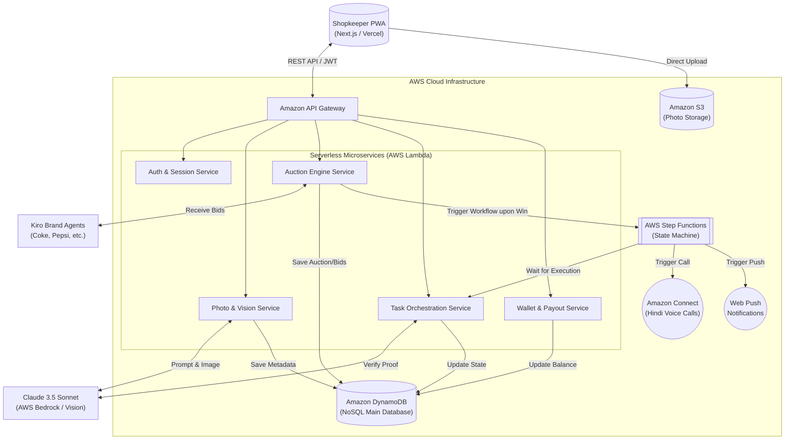
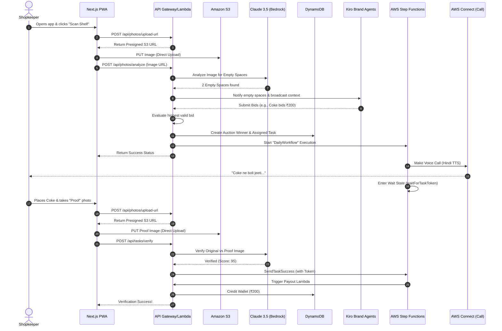

# Shelf-Bidder Architecture

This document visualizes the high-level architecture and the data flow of the Shelf-Bidder Autonomous Retail Ad-Network using Mermaid.js diagrams.

## High-Level System Architecture

The following diagram illustrates the core components of the system: the Next.js Frontend (PWA), the AWS Serverless Backend (API Gateway, Lambda, DynamoDB, S3), the external AI/LLM integrations (Claude 3.5 Sonnet on Bedrock), and the Kiro Brand Agents.

---

## Detailed User Flow Diagram

This sequence diagram maps out the step-by-step API interactions during a typical daily lifecycle.

---

## Technical Stack Overview

- **Frontend**: Next.js 14 App Router, TypeScript, TailwindCSS, Progressive Web App (PWA) with Service Workers & IndexedDB for offline capability.
- **Backend / API**: AWS API Gateway, AWS Lambda (Node.js/TypeScript).
- **Database**: Amazon DynamoDB (Single-Table Design).
- **Storage**: Amazon S3 (using pre-signed URLs to bypass Lambda payload limits).
- **AI / ML**: Amazon Bedrock accessing Anthropic Claude 3.5 Sonnet for multi-modal vision analysis.
- **Orchestration**: AWS Step Functions for managing long-running asynchronous workflows (Task assignment -> waiting for shopkeeper -> verification).
- **Communication**: Amazon Connect (Voice calls), Web Push API.
